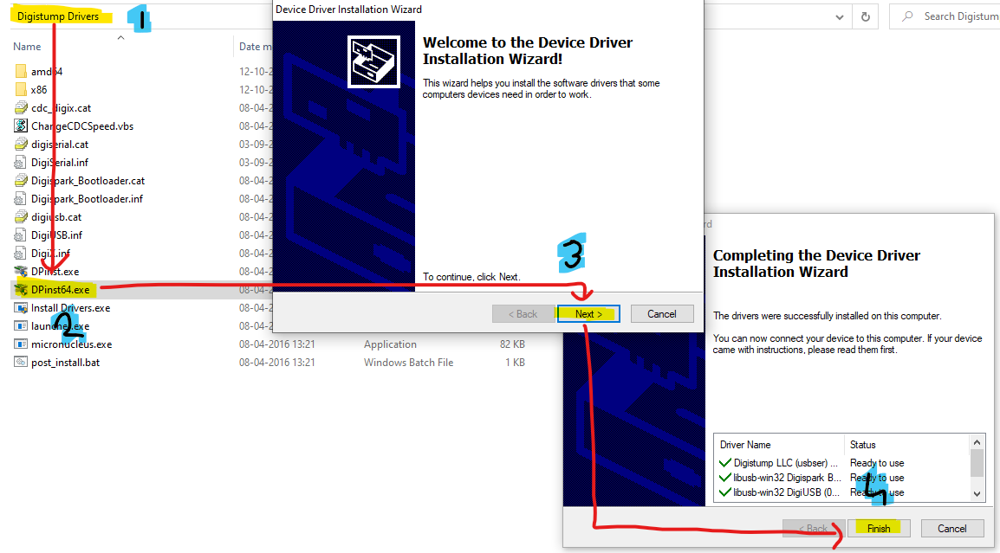
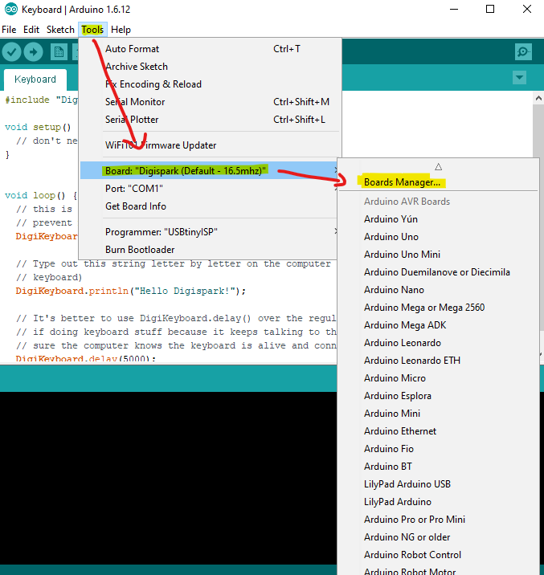
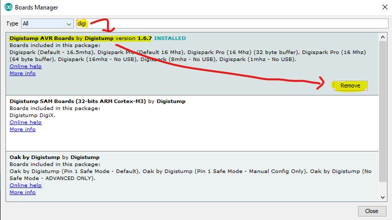
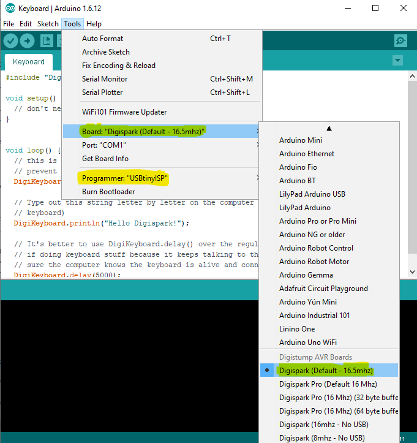
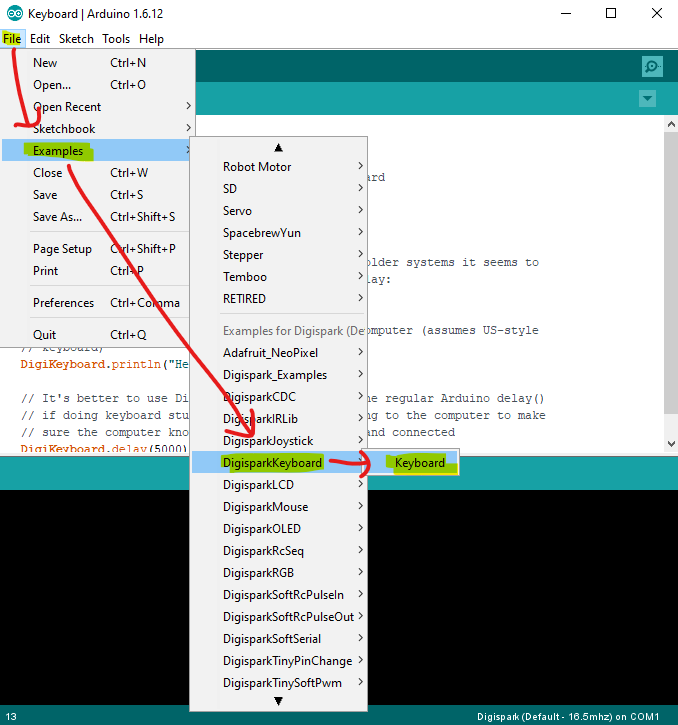
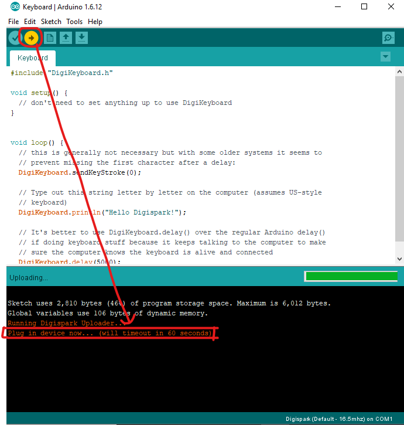
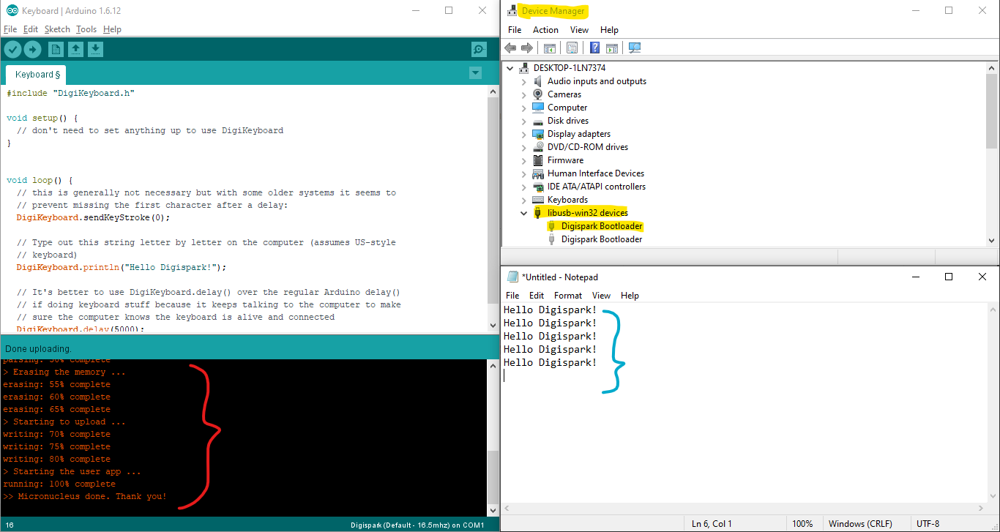

# Digispark ATTiny85(V2)
> USB Rubber Ducky kiler

## Intro
__[Digispark ATTiny85(V2)](https://www.amazon.com/s?k=digispark+attiny85)__ is a microcontroller development board that can be used as __[USB Rubber Ducky](https://shop.hak5.org/products/usb-rubber-ducky)__ alternative. While _USB Rubber Ducky_ comes around _$79.99_ (~$80-$130), _Digispark ATTiny85_ only costs _$4-$6_ (10x less) making it a good _alternative_ choice.
Now the question is why _alternative_ (& not principal)? Because original _USB Rubber Ducky_ looks less suspicious (similar to original pendrive) and memory upto `2GB` sdcard (officially), on the other hand _Digispark ATTiny85_ has a maximum storage of `6012 bytes` (~6kb) and also by design it looks a bit suspicious (which can be compensated by a 3D print cover).
For getting started and testing (& learning abt) some microcontroller development board, it is the way to go!

 

## Requirements
Initially when I tested the _attiny85 board_ with latest version of __[ArduinoIDE](https://www.arduino.cc/en/software)__ nothing happened even the board was not detected. After looking through many online tutorials & articles I figured out that most of them were 5-7yrs old using a previous version of _IDE_ with a setting missing in new one.

- System: _Windows 10_ (but other systems will work probably, but suguest to use windows for the ease of drivers & setup)
- Microcontroller Development Board: _Digispark ATTiny85(V2)_ (can buy from [here](https://www.amazon.com/s?k=digispark+attiny85))
- ArduinoIDE version: _1.6.12_ (which can be found [here](https://www.arduino.cc/en/software/OldSoftwareReleases))
- Drivers: _[Digistump.Drivers.zip](https://github.com/digistump/DigistumpArduino/releases)_ (test with latest version if failed try _1.6.7_)

> You can find the _Drivers & IDE_ in the [zips](./zips) folder for above recommended verisons

 

## Basic _setup_ & _testing_
> I'm considering you are using same version as I recommended above, but your free to try different versions

### setup
1. Install _Digistump Drivers_ (download from _[official github releases](https://github.com/digistump/DigistumpArduino/releases/tag/1.6.7)_ or from _[zips](./zips)_ folder)
- 

2. Open _ArduinoIDE_ > _File_ > _Preferences_ > _Additional Board Manager URLs_ > `http://digistump.com/package_digistump_index.json`
- 
- 

3. _ArduinoIDE_ > _Tools_ > _Boards: "..._ > _Board Manager..._ > Search "digi" > Install "Digistump AVR Boards" (in img it shows _remove_ button as it is aleady installed, but for you it will come install button)
- 
- 

4. _ArduinoIDE_ > _Tools_ >
	a. _Boards: "..._ > Select "_Digispark (Default - 16.5mhz)_"
	b. _Programmer: "..._ > Select "_USBtinyISP_"
- 

### testing
1.  _ArduinoIDE_ > _File_ > _Examples_ > _DigisparkKeyboard_ > "_Keyboard_"
- 

2. Click on the _uplaod button_ (below 'edit' button) & when it says "_Plug in device now..._" insert the _digispark board_ in _usb port_
- 
- if output is not as below, repeat uploading step & try inserting board in different ports (front & rear)
- 
- __red__: sketch uploaded successfully; __blue__: script running successfully; __yellow__: _device manager_ > _libusb-win32 devices_ > _Digispark Bootloader_

 

##

 

## Reference links
- GitHub:
	- https://github.com/CedArctic/DigiSpark-Scripts
	- https://github.com/MTK911/Attiny85
- YouTube:
	- https://www.youtube.com/watch?v=fGmGBa-4cYQ
- Blog/Articles:
	- https://digistump.com/wiki/digispark/tutorials/connecting
	- https://maker.pro/arduino/projects/how-to-build-a-rubber-ducky-usb-with-arduino-using-a-digispark-module

